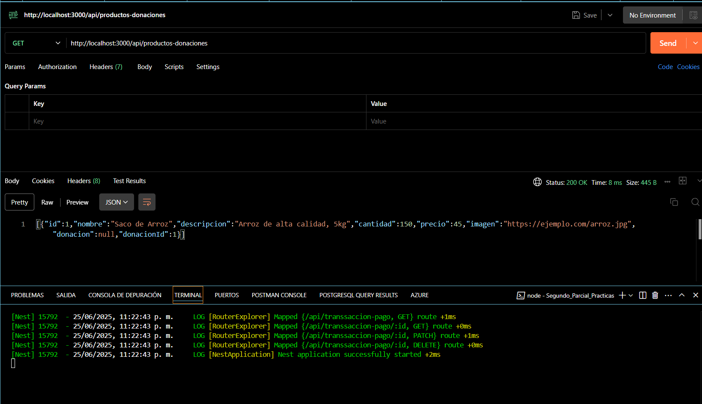

# Sistema de Gestión de Donaciones

## Descripción
Este proyecto es una API REST desarrollada con NestJS que gestiona un sistema completo de donaciones. Implementa tres entidades principales:
- Donaciones: Gestiona las campañas de donación
- Productos de Donaciones: Maneja los productos asociados a cada donación
- Transacciones de Pago: Controla las transacciones financieras relacionadas con las donaciones

## Instalación Detallada

### 1. Creación del Proyecto
```bash
# Clonar el repositorio
git clone https://github.com/Nathaliaaracely/Practicasweb.git
cd Segundo_Parcial_Practicas
```

### 2. Instalación de Dependencias
```bash
# Instalar dependencias básicas
npm install

# Instalar dependencias adicionales para TypeORM y SQLite
npm install @nestjs/typeorm typeorm sqlite3
```

### 3. Configuración de la Base de Datos
La aplicación utiliza SQLite como base de datos. La configuración está en `src/app.module.ts`:
```typescript
TypeOrmModule.forRoot({
  type: 'sqlite',
  database: 'db.sqlite',
  entities: [__dirname + '/**/*.entity{.ts,.js}'],
  synchronize: true
})
```

### 4. Estructura del Proyecto
El proyecto sigue la estructura modular de NestJS:
```
src/
├── donaciones/
│   ├── controllers/
│   ├── services/
│   ├── entities/
│   ├── dto/
│   └── donaciones.module.ts
├── productos-donaciones/
│   ├── controllers/
│   ├── services/
│   ├── entities/
│   ├── dto/
│   └── productos-donaciones.module.ts
└── transsaccion-pago/
    ├── controllers/
    ├── services/
    ├── entities/
    ├── dto/
    └── transsaccion-pago.module.ts
```

### 5. Iniciar el Proyecto
```bash
# Modo desarrollo (hot reload)
npm run start:dev

# Modo producción
npm run start:prod
```

## Instalación

1. Clonar el repositorio:
```bash
git clone https://github.com/Nathaliaaracely/Practicasweb.git
cd Segundo_Parcial_Practicas
```

2. Instalar dependencias:
```bash
npm install
```

3. Iniciar el proyecto:
```bash
npm run start:dev
```

El servidor iniciará en `http://localhost:3000`

## Endpoints





### Donaciones

#### Crear una nueva donación
```bash
POST /api/donaciones
```
Ejemplo de cuerpo:
```json
{
  "name": "Donación Navideña",
  "descripcion": "Donación para familias necesitadas",
  "fechaCreacion": "2025-06-25",
  "fechaLimite": "2025-12-25",
  "estado": "activa",
  "cantidad": 100,
  "valor": 50000
}
```

#### Obtener todas las donaciones
```bash
GET /api/donaciones
```

#### Obtener una donación específica
```bash
GET /api/donaciones/:id
```

#### Actualizar una donación
```bash
PATCH /api/donaciones/:id
```

#### Actualizar el nombre de una donación
```bash
PATCH /api/donaciones/name
```

#### Eliminar una donación
```bash
DELETE /api/donaciones/:id
```

### Productos de Donaciones

#### Crear un nuevo producto de donación
```bash
POST /api/productos-donaciones
```
Ejemplo de cuerpo:
```json
{
  "nombre": "Juguetes",
  "descripcion": "Juguetes para niños",
  "cantidad": 50,
  "precio": 10000,
  "donacionId": 1
}
```

#### Obtener todos los productos de donación
```bash
GET /api/productos-donaciones
```

#### Obtener un producto de donación específico
```bash
GET /api/productos-donaciones/:id
```

#### Actualizar un producto de donación
```bash
PATCH /api/productos-donaciones/:id
```

#### Eliminar un producto de donación
```bash
DELETE /api/productos-donaciones/:id
```

### Transacciones de Pago

#### Crear una nueva transacción de pago
```bash
POST /api/transsaccion-pago
```
Ejemplo de cuerpo:
```json
{
  "monto": 50000,
  "fecha": "2025-06-25",
  "estado": "pendiente",
  "metodoPago": "tarjeta",
  "donacionId": 1
}
```

#### Obtener todas las transacciones de pago
```bash
GET /api/transsaccion-pago
```

#### Obtener una transacción de pago específica
```bash
GET /api/transsaccion-pago/:id
```

#### Actualizar una transacción de pago
```bash
PATCH /api/transsaccion-pago/:id
```

#### Eliminar una transacción de pago
```bash
DELETE /api/transsaccion-pago/:id
```

## Tecnologías Utilizadas
- NestJS
- TypeORM
- SQLite
- TypeScript

## Estructura del Proyecto
El proyecto sigue la estructura estándar de NestJS:
```
src/
├── donaciones/           # Módulo de donaciones
├── productos-donaciones/ # Módulo de productos de donaciones
└── transsaccion-pago/    # Módulo de transacciones de pago

```

## Consideraciones Importantes

### Validación de Datos
El proyecto utiliza class-validator y class-transformer junto con un ValidationPipe global para validar automáticamente los DTOs entrantes. Esto asegura que los datos recibidos cumplan con los requisitos establecidos en cada DTO.

### Manejo de Errores
El proyecto implementa un manejo de errores robusto:
- NotFoundException para entidades no encontradas
- BadRequestException para validaciones fallidas
- InternalServerErrorException para errores del servidor

### Estructura del Proyecto
El proyecto sigue una estructura organizada y coherente:
```
src/
├── donaciones/
│   ├── controllers/
│   ├── services/
│   ├── entities/
│   ├── dto/
│   └── donaciones.module.ts
├── productos-donaciones/
│   ├── controllers/
│   ├── services/
│   ├── entities/
│   ├── dto/
│   └── productos-donaciones.module.ts
└── transsaccion-pago/
    ├── controllers/
    ├── services/
    ├── entities/
    ├── dto/
    └── transsaccion-pago.module.ts
```

### Versionado de la API
La API está versionada con el prefijo `/api/v1/` en todas las rutas. Esto permite:
- Mantener compatibilidad con versiones anteriores
- Implementar cambios sin afectar clientes existentes
- Facilitar la evolución de la API

## Seguridad

### CORS
El proyecto está configurado para permitir CORS desde cualquier origen (para desarrollo). En producción, se recomienda restringir los orígenes permitidos.

### Validación de Tokens
Se recomienda implementar JWT (JSON Web Tokens) para autenticación y autorización en versiones futuras.

## Mejores Prácticas

### Desarrollo
- Utiliza el modo de desarrollo (`npm run start:dev`) para desarrollo
- Ejecuta los tests (`npm run test`) antes de hacer commits
- Mantén el código limpio y documentado

### Producción
- Utiliza variables de entorno para configuraciones sensibles
- Implementa logs de producción
- Monitorea el rendimiento de la API

